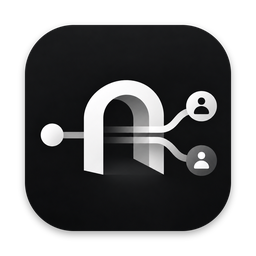
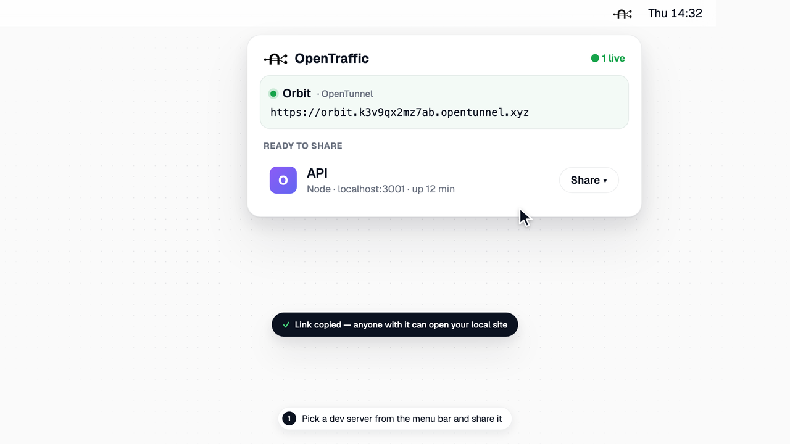
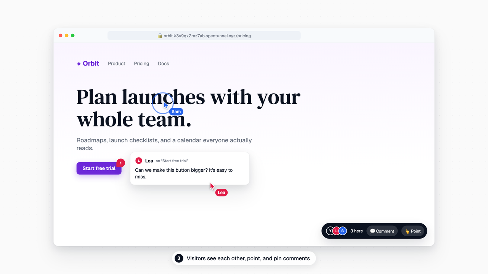
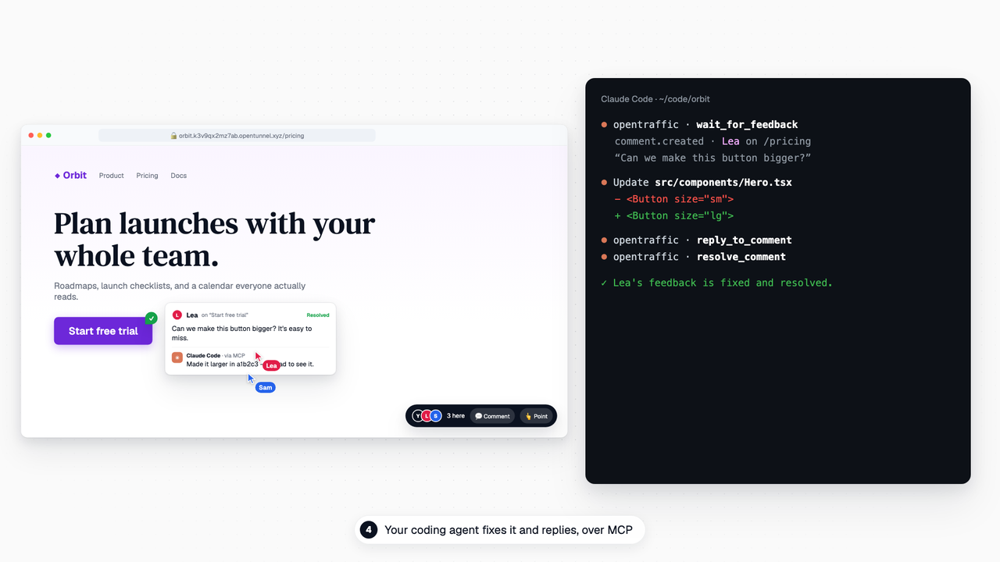
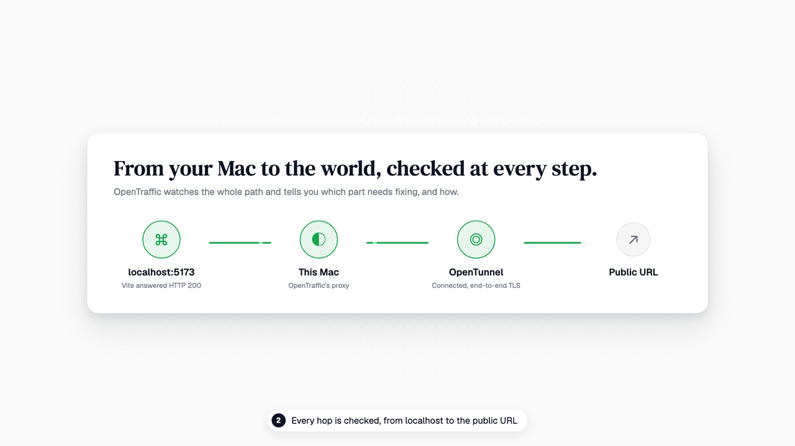

<p align="center">
  
</p>

<h1 align="center">OpenTraffic</h1>

<p align="center">
  <b>Share localhost. Collaborate live.</b><br>
  A macOS menu bar app that puts the dev server you're running on a public URL in one click,<br>
  then lets everyone who opens it point, comment, and follow along.
</p>

<p align="center">
  <a href="https://opentraffic.dev"><b>opentraffic.dev</b></a> ·
  <a href="https://github.com/Medda-systems/OpenTraffic-releases/releases/latest">Latest release</a> ·
  <a href="#install">Install</a>
</p>

<p align="center">
  
  
  <a href="https://github.com/Medda-systems/OpenTraffic-releases/releases/latest"></a>
  
</p>

<p align="center">
  
</p>

## Install

```sh
curl -fsSL https://opentraffic.dev/install | sh
```

This downloads the latest release, checks its checksum and code signature, and puts OpenTraffic in Applications ([read the script](https://github.com/Medda-systems/OpenTraffic-releases/releases/latest/download/install.sh)). Installed copies update themselves.

<details>
<summary><b>Other ways to install</b></summary>

**Homebrew**

```sh
brew tap medda-systems/tap
brew trust --cask medda-systems/tap/opentraffic
brew install --cask opentraffic
```

Homebrew asks you to trust casks from taps outside its official collection; the second line trusts just this one.

**Disk image:** download [`OpenTraffic.dmg`](https://github.com/Medda-systems/OpenTraffic-releases/releases/latest/download/OpenTraffic.dmg), open it, and drag OpenTraffic into Applications. Every version and its checksum are on the [releases page](https://github.com/Medda-systems/OpenTraffic-releases/releases).

Releases aren't notarized by Apple yet, so when installed from the disk image or Homebrew, macOS blocks the first launch. On macOS 15 or later, open **System Settings → Privacy & Security** and click **Open Anyway**; on macOS 14, Control-click the app and choose **Open**.

</details>

Requires macOS 14 or later (Apple silicon or Intel). Cloudflare shares need `cloudflared` (`brew install cloudflared`); Tailscale, ngrok, and OpenTunnel are optional.

## What it does

<table>
  <tr>
    <td width="50%" valign="top">
      
      <h3>One click from localhost to a link</h3>
      Every web server running on your Mac shows up in the menu bar. Pick one, pick how to publish it — a temporary Cloudflare URL, a lasting OpenTunnel address, your tailnet, ngrok, or your own domain — and the link is on your clipboard.
    </td>
    <td width="50%" valign="top">
      
      <h3>Live collaboration on the real thing</h3>
      Everyone who opens the link sees each other's cursors, follows you as you browse, points at things, and pins comments to elements — with a picture, their browser, and the errors they hit.
    </td>
  </tr>
  <tr>
    <td width="50%" valign="top">
      
      <h3>Feedback your coding agent can act on</h3>
      Claude Code, Codex, Cursor, opencode, or any MCP client can share your server, wait for comments, fix what people point at, reply, and resolve — while you watch it happen on the page.
    </td>
    <td width="50%" valign="top">
      
      <h3>Every hop checked</h3>
      The connection path checks your server, this Mac, the tunnel, and the public URL, and offers the fix when something's off — like the Host header Vite and Next.js insist on.
    </td>
  </tr>
</table>

| Publish through | What you get |
| --- | --- |
| **Cloudflare** | A temporary `trycloudflare.com` URL with no account, or a lasting hostname on your own domain |
| **OpenTunnel** | A lasting `opentunnel.xyz` address, encrypted until it reaches your Mac — no account |
| **Tailscale** | Private to your tailnet's devices, or public through Funnel |
| **ngrok** | Your ngrok domain, with request inspection, replay, and password or sign-in protection |

Also: a command-line tool and `opentraffic://` links for scripts and Shortcuts, a local REST API, MCP server and signed webhooks, auto-stop timers, projects that start together, and notifications when a link is ready or someone joins.

## Privacy

OpenTraffic has no account, analytics, or telemetry. It talks to the tunnel providers you choose, checks this repository once a day for updates (you can turn that off), and keeps credentials in your Keychain.

## Updates

Each release carries `appcast.xml`, the feed installed copies check. The feed and every disk image are signed with Medda Systems' update key and verified before anything is installed.

---

OpenTraffic is made by [Medda Systems](https://medda.se) and released under the MIT License. Cloudflare, Tailscale, ngrok, and OpenTunnel are trademarks of their respective owners; OpenTraffic isn't affiliated with or endorsed by them.
